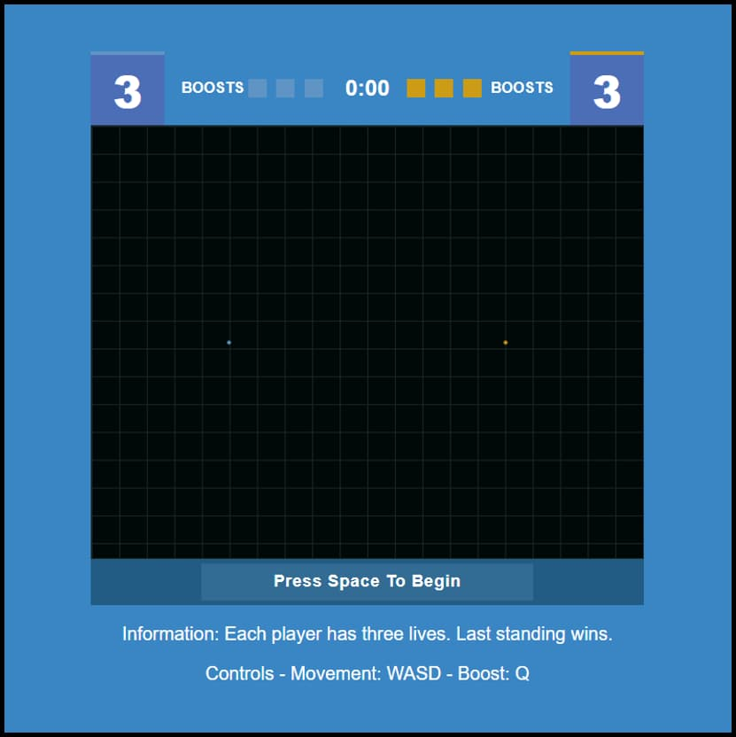
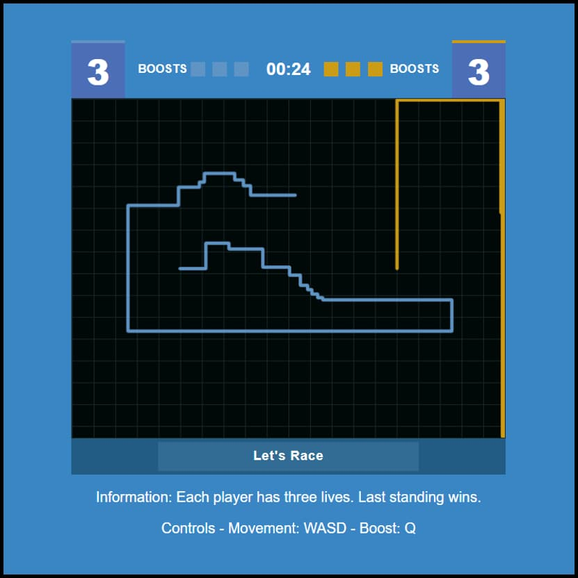
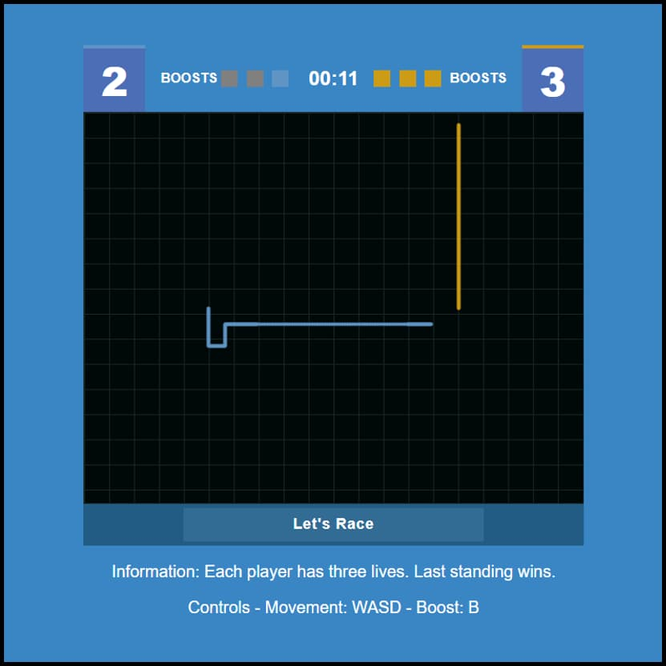
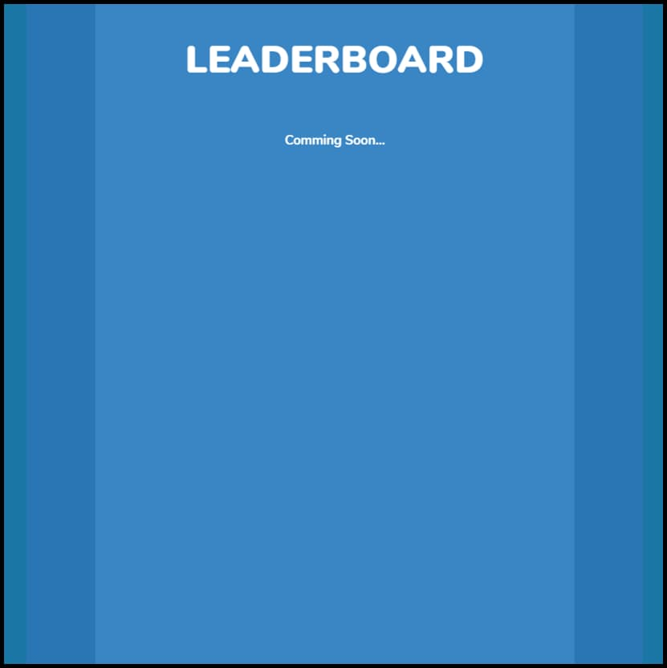

# TRON

## Description

### How to play

The light-cycles are controlled using the WASD keys, and the B key is used to activate the cycle's boost. Press any key to start the game.

## Roadmap

Future features:

* Improved computer AI
* Leadboard (for time survived against CPU)
* Two player mode

## Screenshots

